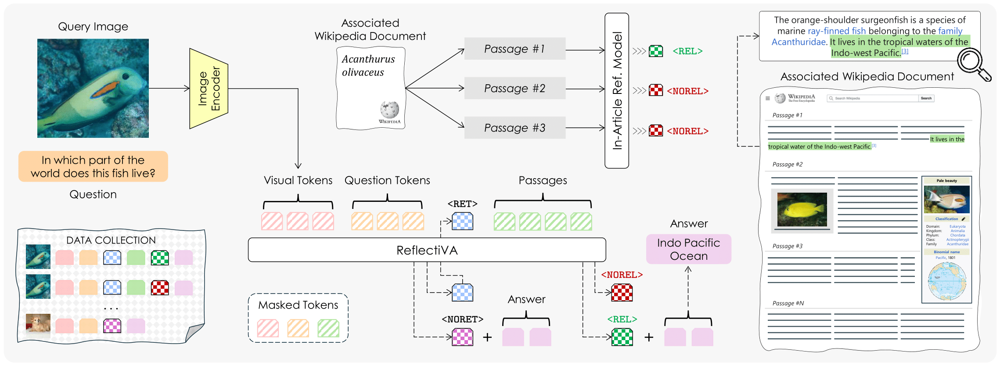

<div align="center">
  <h1>Reflective LLaVA (ReflectiVA)</h1>
  <h2>Augmenting Multimodal LLMs with Self-Reflective Tokens for Knowledge-based Visual Question Answering

  (CVPR 2025)
  </h2>
   
</div>

<br></br>
<p align="center">
  

</p> 

This repository contains the reference code for the paper [Augmenting Multimodal LLMs with Self-Reflective Tokens for Knowledge-based Visual Question Answering](https://arxiv.org/abs/2411.16863).

[🎯 Project web page](https://aimagelab.github.io/ReflectiVA/) |
[Paper](https://arxiv.org/pdf/2411.16863) |
[🤗 HuggingFace Model](https://huggingface.co/aimagelab/ReflectiVA) |
[🤗 HuggingFace Dataset](https://huggingface.co/datasets/aimagelab/ReflectiVA-Data) |

## Table of Contents

1. [Citation](#citation)
2. [Overview](#overview)
3. [Installation](#installation)
4. [Model](#model)
5. [Knowledge Based](#knowledge-based)
6. [Inference](#inference)
7. [Acknowledgements](#acknowledgements)

## Citation

Please cite this work with the following BibTeX:
```
@inproceedings{cocchi2024augmenting,
  title={{Augmenting Multimodal LLMs with Self-Reflective Tokens for Knowledge-based Visual Question Answering}},
  author={Cocchi, Federico and Moratelli, Nicholas and Cornia, Marcella and Baraldi, Lorenzo and Cucchiara, Rita},
  booktitle={Proceedings of the IEEE/CVF Conference on Computer Vision and Pattern Recognition},
  year={2025}
}
```

## Overview
Multimodal LLMs (MLLMs) are the natural extension of
large language models to handle multimodal inputs, combining text and image data. 
They have recently garnered attention due to their capability to address complex tasks involving both modalities. 
However, their effectiveness is limited to the knowledge acquired during training, which restricts their practical utility. 
In this work, we introduce a novel method to enhance the adaptability of MLLMs by integrating external knowledge sources. 
Our proposed model, Reflective LLaVA (```ReflectiVA```), utilizes reflective tokens to dynamically determine the need for external knowledge 
and predict the relevance of information retrieved from an external database, ultimately enables the MLLM to manage external knowledge 
while preserving fluency and performance on tasks where external knowledge is not needed.

## Installation
To create the conda environment named reflectiva use the following instructions.
With this environment you have all the packages to run the code inside this repo. 
```
conda create -n reflectiva python==3.8.16
conda activate reflectiva
pip install -r requirements.txt
```

## Model
You can access the official model weights for the [ReflectiVA model](https://huggingface.co/aimagelab/ReflectiVA) on 🤗 Hugging Face.

## Dataset
The official [training dataset](https://huggingface.co/datasets/aimagelab/ReflectiVA-Data) can be accessed on 🤗 Hugging Face.

#### Data Infoseek
You can use this [link](https://ailb-web.ing.unimore.it/publicfiles/drive/reflectiva/data_infoseek.zip) to download the evaluation data for Infoseek.

#### Data Encyclopedic-VQA
You can find the evaluation data for Encyclopedic-VQA at this [link](https://ailb-web.ing.unimore.it/publicfiles/drive/reflectiva/data_evqa.zip). Additionally, the images used for evaluation can be extracted from this [zip file](https://ailb-web.ing.unimore.it/publicfiles/drive/reflectiva/evqa_inference_images.zip).

## Knowledge Based
In our work two different main knowledge based are utilized.
To enhance the reproducibility of our approach, we provide access to both the knowledge bases and the FAISS index built on them for the best configuration presented in the paper. Specifically, the embeddings are generated using the [EVA-CLIP](https://huggingface.co/BAAI/EVA-CLIP-8B) model.

For Infoseek, you can find the [index](https://ailb-web.ing.unimore.it/publicfiles/drive/reflectiva/index/infoseek_EVA_text_summary/knn.index) and [json](https://ailb-web.ing.unimore.it/publicfiles/drive/reflectiva/index/infoseek_EVA_text_summary/knn.json) file here.
Similarly, the [index](https://ailb-web.ing.unimore.it/publicfiles/drive/reflectiva/index/evqa_EVA_image/knn.index) and [json](https://ailb-web.ing.unimore.it/publicfiles/drive/reflectiva/index/evqa_EVA_image/knn.json) file for Encyclopedic-VQA are available here.

Please refer to the paper to more information about KB. 
<!-- Please refer to the [KB page](KNOWLEDGE_BASED.md) to find all the details. -->

## Inference
Before running the inference, unzip the data and modify the paths in the `.sh` files to align with your local cluster setup and the files downloaded in the previous step.

Inference code for Infoseek:
```bash
sbatch scripts/ReflectiVA_infoseek.sh
```

Inference code for Encyclopedic-VQA:
```bash
sbatch scripts/ReflectiVA_evqa.sh
```

## Acknowledgements
We acknowledge the CINECA award under the ISCRA initiative, for the availability of high-performance computing resources and support. 
This work has been conducted under a research grant co-funded by Altilia s.r.l., and supported by the PNRRM4C2 project “FAIR - Future Artificial 
Intelligence Research”, funded by the European Commission,
and by the PNRR project “Italian Strengthening of Esfri
RI Resilience” (ITSERR) funded by the European Union -
NextGenerationEU (CUP B53C22001770006).

We are thankful to [LLaVA](https://github.com/haotian-liu/LLaVA), [lmms-eval](https://github.com/EvolvingLMMs-Lab/lmms-eval) for releasing their models and code as open-source contributions.

Finally, we would also like to thank Davide Caffagni and Sara Sarto for their valuable support and insights.
